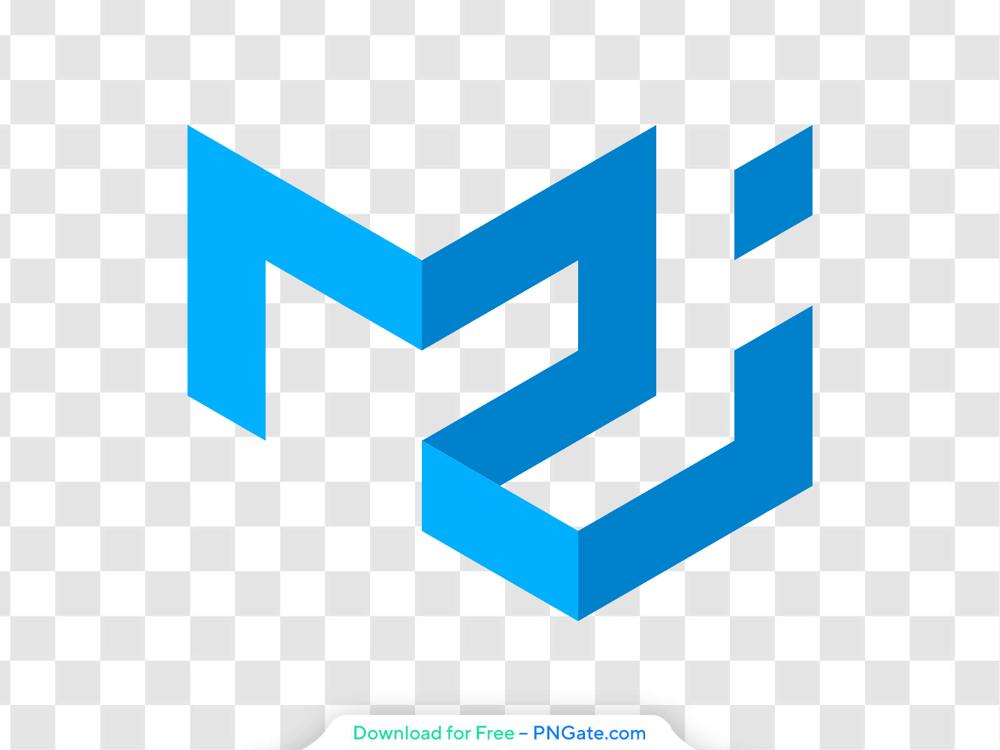
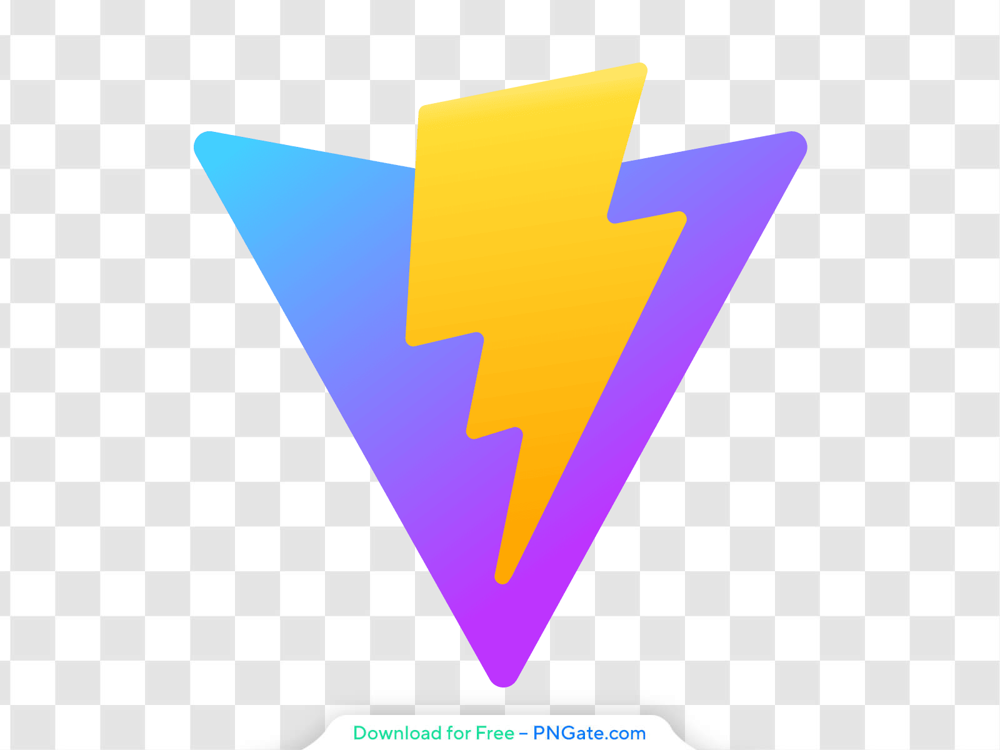

  
   
    

<h1> 👋 Hi there</h1>

  

<h2> 🧰  My toolbox</h2>

  
 &nbsp;
 &nbsp;
 &nbsp;
  &nbsp;
 &nbsp;
  &nbsp;
 &nbsp;
 &nbsp;
 &nbsp;
 &nbsp;
 &nbsp;
 
 

<!--<h2> 📊  Stats</h2>-->
<h2> 📞 Contact me</h2>
<!--

&nbsp;
&nbsp;
&nbsp;
&nbsp;

-->

   &nbsp;
   &nbsp;
    
   

