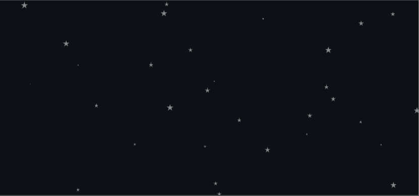
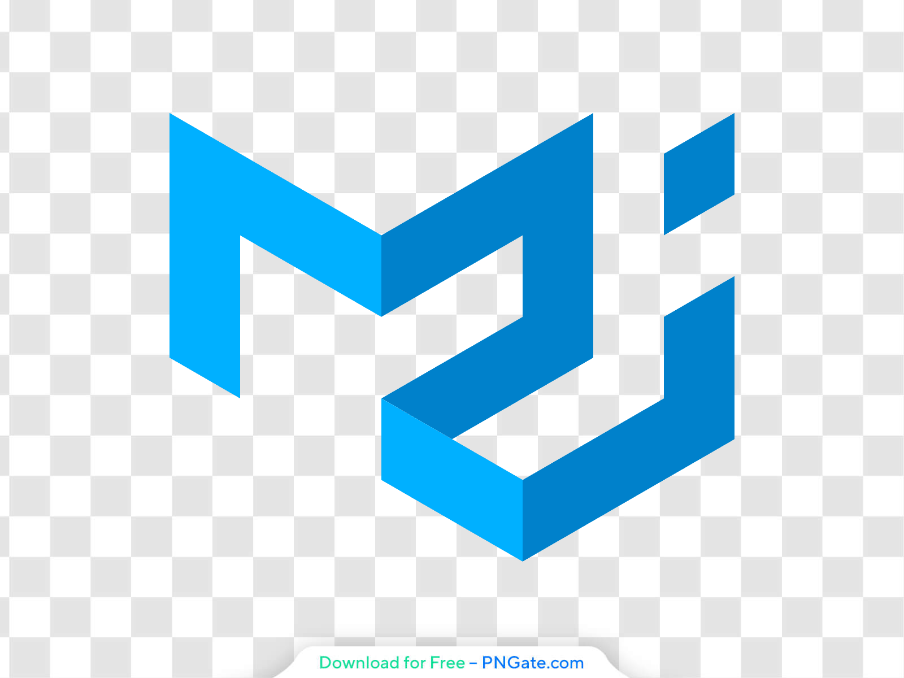
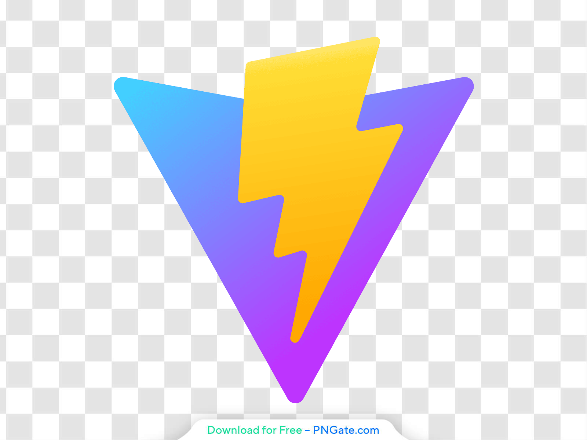

  
   
    

<h1>👋 Hi there</h1>
<h2>About me:</h2>
<h3> Frontend developer | Software Engineering Graduate</h3>  

 💻 Proficient in: JavaScript(ES6) | TypeScript | React | Next.js | TailwindCSS | CSS | HTML 

🎨 UI/UX & Design: Transforming Figma concepts into clean, responsive components  

🗄️ Other Skills: Familiar with SQL server, Adobe Photoshop

📚 Current Learning: Three.js & 3D Frontend Design 

🤖  Interests: Expanding expertise in Backend Development & Artificial Intelligence   

🌐 Languages: German, English  

✨ Ethos: "More knowledge === better life"
 

<h2> 🧰 My toolbox</h2> 

  
&nbsp;
&nbsp;
&nbsp;
 &nbsp;
&nbsp;
 &nbsp;
&nbsp;
 &nbsp;
&nbsp;
&nbsp;
&nbsp;
 &nbsp;

 

 

<h2> 📞 Contact me</h2>

   &nbsp;
  
    

